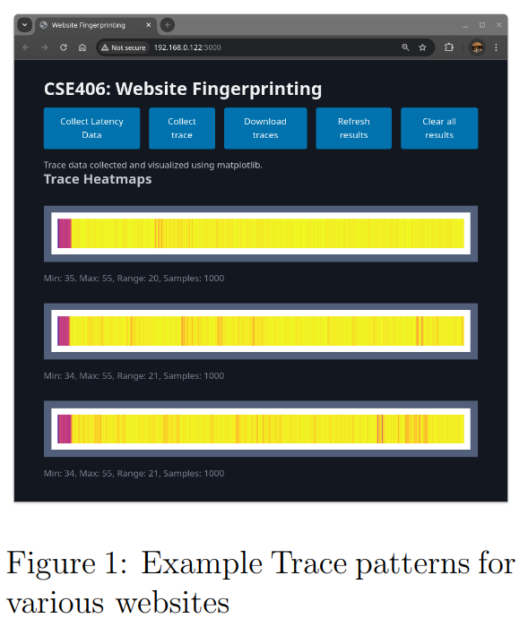

## Assignment | Side-Channel Attack CSE406 - Computer Security

## Introduction

You are scrolling through the internet like always. A friend of yours sends a very harmless link to his blog. You open it in a new tab and then continue browsing on other tabs. What if I told you your friend could figure out what website you are visiting without seeing your screen or network traffic?

Sounds like something from a movie, right? Well, buckle up because that's exactly what we're going to do in this assignment!

## What is a Side-Channel Attack?

A side-channel attack is like being a detective who figures out what's happening inside a room not by looking through the door, but by listening to the sounds, or measuring the heat coming from under the door. Instead of exploiting security vulnerabilities directly, these attacks gather information from the physical implementation of a system - things like timing, power consumption, or in our case, how a processor's cache is being used.

In this assignment, we're focusing on website fingerprinting - a technique where we'll identify what website someone is visiting without seeing their screen or network traffic. Instead, we'll run some JavaScript code that measures subtle patterns in how the computer's resources are being used. With this data, we'll train a machine learning model that can recognize specific websites!

## Types of Side-Channel Attacks

There are two main flavors of side-channel attacks in our context:

1. On-path attacks: These happen from a different machine than the victim. The attacker observes network traffic patterns (like packet timing and sizes) to infer what website is being visited.
2. Co-located attacks: These happen from the same machine as the victim. The attacker and victim share resources like the CPU cache, and the attacker measures how these shared resources behave.

We'll be focusing on co-located attacks, specifically using a technique called the Sweep Counting Attack. This approach measures how many times we can access memory within fixed time windows, which changes based on how busy the cache is with the victim's activity. Don't worry if this sounds complex - we'll break it down step by step!

# Our Technological Toolbox

For this assignment, we're providing you with starter code which you will complete to solve the tasks. The starter code uses the following technologies:

## Tech Stack

- Flask - A lightweight Python web framework for our backend.
- Alpine.js - A minimalistic JavaScript framework to make UI easier.
- Pico CSS - A tiny CSS framework that makes things look good.
- Selenium - A browser automation tool for data collection.
- SQLite - A lightweight database for storing our collected data.
- PyTorch - A powerful machine learning library for building and training our models.

It is strongly recommended to use the provided framework to avoid spending too much time on selecting libraries and setting up the environment. The framework is designed to be simple so that you can focus on security and experimentation rather than web development.

## Important Tips

> Install the required dependencies with pip install -r requirements.txt
> You might have to install the Chrome WebDriver for Selenium.

## 1 Task 1: Warming Up with Timing (10%)

Let's start with something easy but important. Understanding the "channel" in our side-channel attack: timing! We need to be able to measure time as precisely as possible to get information from the cache.

## The Warmup Challenge

Modern browsers deliberately reduce the precision of their timing functions to prevent exactly the kind of attacks we're trying to build! Let's see just how precise we can get with the tools we have.

# Where to Edit

static/index.html, static/index.js, static/warmup.js

In this task, you will implement a simple timing measurement function in JavaScript. To get started download the starter code from moodle. Right now it contains a simple web page served by Flask with a button that says "Collect Latency Data".

The frontend UI is defined in static/index.html. When you click the button "Collect Latency Data", it will call the function collectLatencyData() in static/index.js. The function launches a background worker thread that is defined in static/warmup.js to collect the latency data. The worker returns the data to the main thread in static/index.js and it is displayed in a table in static/index.html.

Your task is to implement the readNlines (n) function in static/warmup.js to measure the time it takes to read n cache lines. Where n varies from 1 to 10 million.

## What is performance.now()?

performance.now() is JavaScript's high-resolution time measurement API. It returns a timestamp in milliseconds, measured from the start of the page load. Unlike Date.now(), it provides microsecond precision (though browsers often limit this for security reasons).

## What is a cache line?

A cache line is the smallest unit of data that can be transferred between the main memory and the cache. When a CPU accesses memory, it retrieves a whole cache line (typically 64 bytes) instead of just the requested byte. This is because (a) accessing memory is slow, and (b) the subsequent bytes in the cache line are likely to be accessed soon after.

Due to this principle, if we access a byte in a cache line, the entire cache line is loaded into the cache. Therefore, reading through a buffer at intervals of LINESIZE ensures that we are accessing different cache lines.

For this task you will have to:

1. Find the size of cache lines on your machine (typically 64 bytes). On linux you can do this by running getconf -a | grep CACHE.
2. In the readNlines (n) function, implement the following steps:

- Allocate a buffer of size n * LINESIZE (where LINESIZE is the cache line size)
- Read through this buffer at intervals of LINESIZE to ensure you're accessing different cache lines
- Read the entire buffer 10 times
- Measure how long this takes using JavaScript's performance.now() function
- Return the median access time

3. Call the readNlines (n) function in the worker thread with n=1,10,...,10,000,000 and return the result to the main thread. If for some value of n the function fails, just break the loop.
4. From static/index.js, update app state and display the results in a table in static/index.html. (This might already be done for you, but make sure it works!)
5. Get an overall understanding of the workflow (button -> worker thread -> data collection -> presentation) because next time you will do it on your own.

# Implementation Requirements

## Testing Guidelines

- [ ] Implement the readNlines (n) function in static/warmup.js
- [ ] Use the performance.now() function to measure time
- [ ] From the cache access latency data, estimate the resolution of the timing function performance.now()
- [ ] Determine how many cache accesses are necessary to measure differences in time using performance.now()
- [ ] Record latency data and your observations in the final report

## 2 Task 2: Trace Collection with the Sweep Counting Attack (35%)

Now we're getting to the exciting part! It's time to implement a real side-channel attack technique called the Sweep Counting Attack.

## The Attack Concept

The idea is brilliantly simple:

1. Allocate a buffer large enough to fill a significant portion of the Last Level Cache (LLC)
2. Start counting how many times you can sequentially access each cache line in this buffer within fixed time windows of P milliseconds
3. Collect these counts for about 10 seconds, creating an array of measurements
4. This pattern of measurements will look different depending on what website is running in another tab!

# Where to Edit

static/worker.js, static/index.html, static/index.js, app.py

In this task, you will implement the core functionality of our side-channel attack. To get started, examine the template code in the files mentioned above. You'll notice that the UI is partially implemented, but several key components are missing.

The Sweep Counting Attack works by measuring how much of the cache is being used by the victim. When a website loads in one tab, it accesses memory that gets cached in the LLC. This affects how quickly our code can access its own memory in another tab, creating a measurable side channel.

## What is the Last Level Cache (LLC)?

The Last Level Cache (LLC) is the largest and slowest cache in the CPU's memory hierarchy, typically L3 cache on modern processors. It's shared among all cores, which is what makes our attack possible - code running in different browser tabs can affect each other through this shared resource. The size of the LLC varies by processor but is typically in the range of 8-32 MB.

For this task you will have to:

1. Find LLCSIZE (the size of the Last Level Cache) on your machine. Use getconf -a | grep CACHE on Linux or check your CPU specifications.
2. Complete the sweep (P) function in worker.js to:

- Allocate a buffer of size LLCSIZE (the size of the Last Level Cache)
- Read through this buffer at intervals of LINESIZE to access different cache lines
- Count how many sweeps can be performed in P milliseconds
- Repeat this measurement K = TIME / P times (for a total of 10 seconds)
- Return the array of sweep counts

3. Pick a suitable value for P based on your experiments in Task 1,

- It must be small enough to get a lot of measurements but large enough to be reliably measured by performance.now()

4. Add the "Collect Trace" button in index.html that calls collectTraceData()
5. Implement collectTraceData() in index.js to:

- Start the worker thread that runs your sweep() function
- Handle the data returned from the worker
- Send the collected data to the backend for visualization

6. Implement the Flask endpoint /collect_trace in app.py to:

- Receive trace data from the frontend as JSON
- Generate a heatmap visualization using matplotlib
- Store both the raw data and the visualization
- Return the image to display in the frontend

7. Implement showing the heatmap in the UI in index.html and index.js

- Display the heatmap images in the UI

8. Implement the Flask endpoint /clear_results in app.py to:

- Clear the stored traces and visualizations

9. Implement "Download Traces" and "Clear Results" buttons in the UI

# Implementation Requirements

- [ ] Implement a sweep() function that produces meaningful measurements
- [ ] Create a user interface that allows collecting and visualizing traces
- [ ] Implement proper data handling both in frontend and backend

## 3 Task 3: Automated Data Collection (20%)

Manual data collection is tedious and inconsistent. Let's automate it!

## Automation Challenge

In this task, you'll use Selenium (a browser automation tool) to collect website fingerprinting data automatically and store it persistently in a database.

# Where to Edit

collect.py

In this task, you will implement automation to collect a substantial dataset of website fingerprints. The starter code includes a partially implemented Selenium script (collect.py) and a database module (database.py) that uses SQLite to store collected traces.

Selenium is a powerful browser automation tool that allows you to programmatically control web browsers. We'll use it to automatically open different websites and collect their fingerprinting traces.

As you run your experiments, you will notice they will take a long time to complete. Your system might shutdown or the browser might crash unexpectedly. We do not want to lose our data in any such event. So, we will use a SQLite database to store our traces. Conveniently for you, the starter code already includes a database module database.py that uses SQLite to store collected traces. You will integrate this module into your automation script to ensure that all collected traces are stored reliably.

## What is Selenium?

Selenium is a framework for browser automation that lets you control browsers programmatically. It can simulate user actions like clicking, typing, scrolling, and navigating between pages. This is perfect for our needs because we can automatically visit websites and collect their side-channel traces.

For this task you will have to:

1. Complete the data collection functions in collect.py to:

- Start the Flask server if it's not already running
- Open the fingerprinting page in one browser tab
- Open one of the target websites (like prothomalo.com, buet.ac.bd, google.com) in another tab
- Simulate user activity by scrolling randomly on the target website
- Trigger trace collection on the fingerprinting page
- Download the trace data
- Repeat for multiple websites and multiple times per website

2. Store the collected trace data reliably in a database by integrating database.py.
3. Test your implementation by collecting at least 10 traces for each of 3 different websites

# Implementation Requirements

- [ ] Implement robust automation that can run unattended for extended periods
- [ ] Ensure proper error handling to prevent crashes during long collection runs
- [ ] Store collected traces in the SQLite database with appropriate metadata
- [ ] Implement a clean shutdown procedure that saves all data before exiting
- [ ] Document any browser-specific configurations needed for your solution

## 4 Task 4: Machine Learning for Website Classification (25%)

Now for the grand finale - using machine learning to identify websites from their traces!

## ML Challenge

In this task, you'll train a neural network model that can identify which website a user is visiting based solely on side-channel measurements.

## Where to Edit

train.py

In this task, you will implement the machine learning component that turns our raw traces into a powerful classifier. The starter code includes a partially implemented PyTorch training script with neural network model definitions.

This is where the true power of our side-channel attack becomes apparent - with enough data and the right model, we can accurately determine which website someone is visiting without ever seeing their screen or network traffic.

## PyTorch Overview

PyTorch is a popular machine learning library that provides a flexible and intuitive approach to building neural networks. It includes tools for defining models, loading data, training, and evaluating performance. The starter code includes several model architectures, but you're free to modify them or create your own.

For this task you will have to:

1. Complete the data loading and preprocessing functions in train.py:

- Load the trace data from your SQLite database or the exported JSON file
- Convert the raw traces into a format suitable for training
- Split the data into training and testing sets
- Normalize the data (e.g., standard scaling or min-max scaling)

2. Call the train() function to train your model(s) with suitable parameters.
3. After training, load the best model and evaluate its performance on the test set by calling evaluate() with suitable parameters.
4. Analyze and document your findings:

- Identify which websites are easiest/hardest to classify
- Experiment with different model architectures or hyperparameters
- Analyze how the amount of training data affects performance
- Document your observations in your report

# Implementation Requirements

- [ ] Achieve at least 60% classification accuracy with at least 3 different websites
- [ ] Implement proper data loading, preprocessing, and model training
- [ ] Provide comprehensive evaluation metrics and visualizations
- [ ] Document your approach and findings in your report
- [ ] Save your trained model so it can be used in the bonus task

## Tips

- Start with simple models before trying complex architectures
- Experiment with different learning rates and batch sizes
- Try different data preprocessing approaches
- Ensure your dataset is balanced (about the same number of traces per website)
- Remember that more data usually leads to better performance
- If you struggle to get good results, you can try disabling sandboxing in your browser (e.g., --no-sandbox for Chrome)

## 5 Bonus Tasks: Going Above and Beyond

Finished the main tasks? Awesome! We have some exciting bonus tasks for you.

# Bonus Task 1: Advanced Side Channel Attacks (35%)

Research and implement more sophisticated side-channel techniques to increase accuracy and evade hardware defenses like prefetchers. You can find some fascinating approaches in the literature!

## Bonus Task 2: Collaborative Dataset Collection (20%)

Collect a substantial dataset (≥ 50,000 datapoints) by collaborating with classmates. This can dramatically improve your model's accuracy and generalization abilities.

## Bonus Task 3: Real-Time Website Detection (15%)

Deploy your trained model in the Flask app so users can see which website they're likely visiting in an adjacent tab in real-time. This creates a powerful demo of your side-channel attack!

## Bonus Task 4: Beat the Complex CNN Model (30%)

Can you outperform the complex CNN model? Implement advanced ML techniques or algorithms to push classification accuracy even higher.

## 6 Submission Guidelines

## Submission Process

1. Create a folder named: 2005039
2. Include the following files:

- static/warmup.js, static/worker.js - Background worker implementation
- static/index.html, static/index.js - Frontend implementation
- app.py - Backend implementation with visualization
- collect.py - Selenium automation script
- database.py - Database integration
- train.py - Machine learning model implementation
- dataset.json/webfingerprint.db - Your collected dataset
- model.pth - Your best performing model
- report.pdf - A brief report describing your findings

## Important Notes

- Your code must be original - no copying from peers
- You are allowed to use online resources and LLMs
- No submissions will be accepted after the deadline
- Start early, experiment a lot and have fun!
- Report your findings and any challenges you faced

## Happy hacking!

## Further Reading

1. Robust Website Fingerprinting Through the Cache Occupancy Channel
2. Prime+Probe 1, JavaScript 0: Overcoming Browser-based Side-Channel Defenses

## Acknowledgment

This assignment is adapted from the "Website Fingerprinting Lab" originally created by Jack Cook, Mengjia Yan, Joseph Ravichandran, and Peter Deutsch for the MIT course 6.5950/6.5951 (Secure Hardware Design).
