# ICMP Attack Tool - Network Diagrams

This document contains visual diagrams using Mermaid to illustrate the network setup, attack flows, and defense mechanisms described in the technical guides.

## Table of Contents
1. [Network Namespace Topology](#network-namespace-topology)
2. [ICMP Redirect Attack Flow](#icmp-redirect-attack-flow)
3. [Packet Structure Diagrams](#packet-structure-diagrams)
4. [Defense Architecture](#defense-architecture)
5. [Attack Verification Process](#attack-verification-process)
6. [Kernel Protection Layers](#kernel-protection-layers)

---

## Network Namespace Topology

### Lab Environment Setup

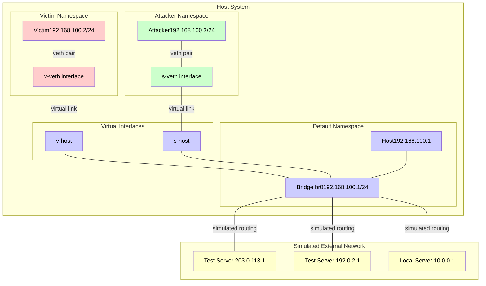

### Network Isolation Concept

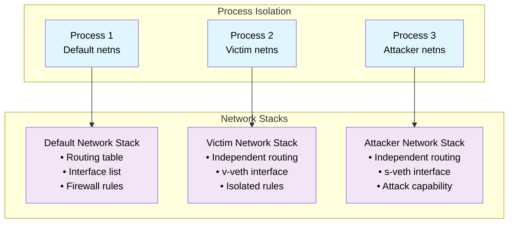

---

## ICMP Redirect Attack Flow

### Normal Routing vs Attack

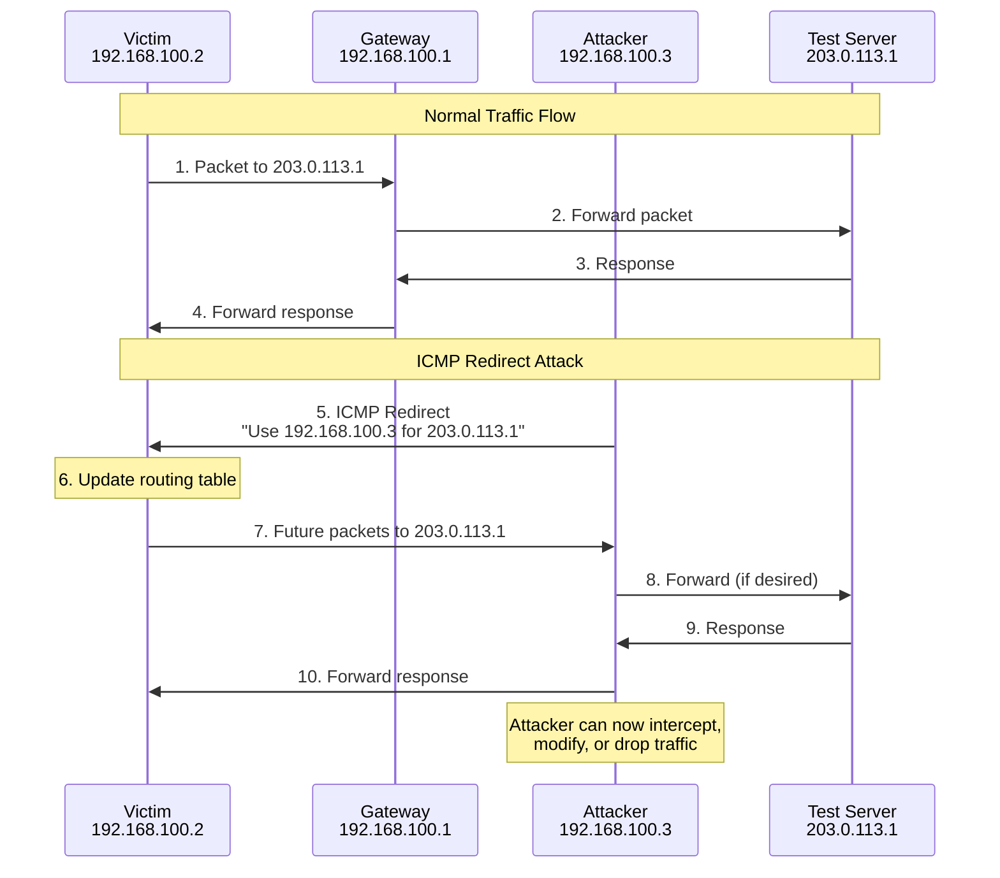

### Attack Packet Structure Flow

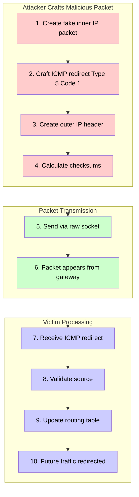

---

## Packet Structure Diagrams

### IP Header Structure (20 bytes)

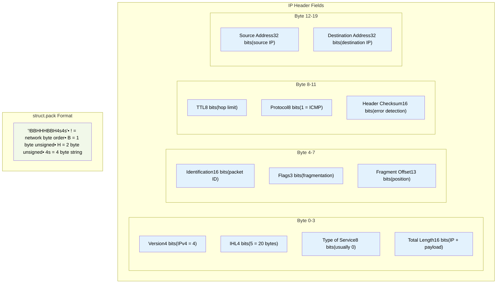

### ICMP Packet Types

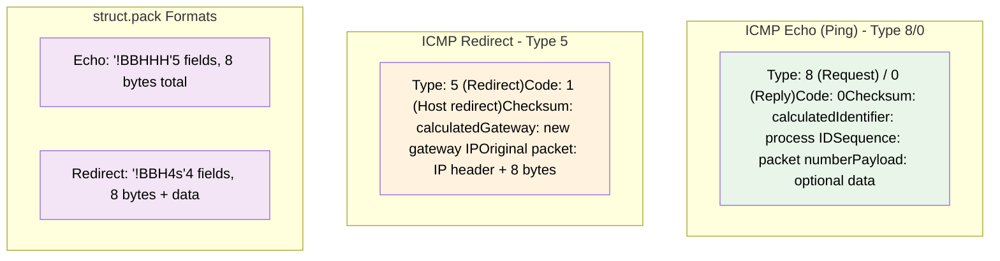

---

## Defense Architecture

### Multi-Layer Defense Strategy

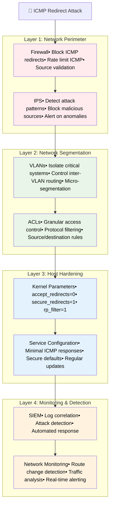

### Kernel Protection Mechanisms

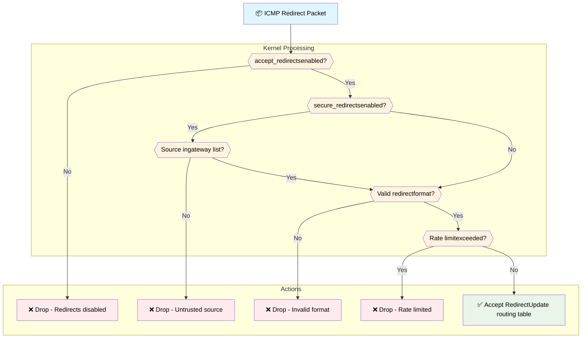

---

## Attack Verification Process

### Multi-Terminal Monitoring Setup

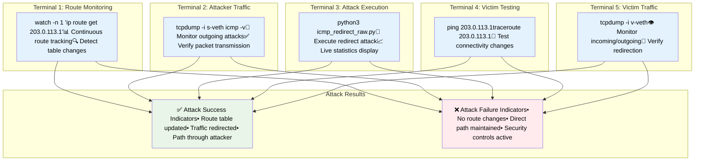

### Attack Success Timeline

```mermaid
gantt
    title ICMP Redirect Attack Timeline
    dateFormat X
    axisFormat %Xs
    
    section Preparation
    Setup namespaces           :done, prep1, 0, 5s
    Configure interfaces       :done, prep2, 5s, 10s
    Start monitoring           :done, prep3, 10s, 15s
    
    section Attack Execution
    Send ICMP redirect         :active, attack1, 15s, 17s
    Kernel processes packet    :attack2, 17s, 18s
    Route table update         :attack3, 18s, 20s
    
    section Verification
    Monitor route changes      :verify1, 20s, 60s
    Test connectivity          :verify2, 25s, 35s
    Capture redirected traffic :verify3, 30s, 60s
    
    section Analysis
    Generate attack report     :analysis1, 60s, 70s
    Document results           :analysis2, 65s, 75s
```

---

## Kernel Protection Layers

### sysctl Parameter Hierarchy

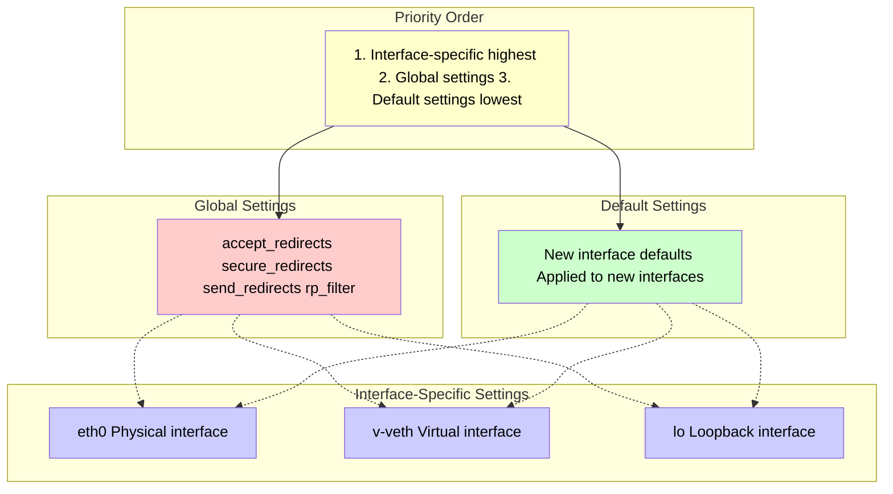

### Lab vs Production Configuration

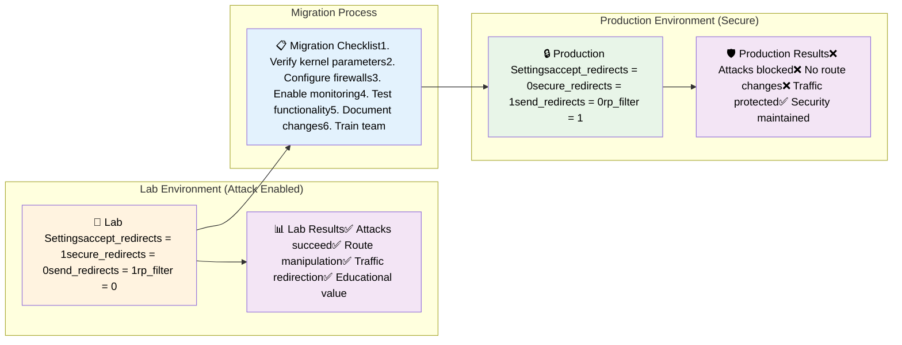

---

## Summary

These diagrams illustrate the complete ICMP attack ecosystem:

1. **Network Topology**: Shows the namespace isolation and virtual networking setup
2. **Attack Flow**: Demonstrates how ICMP redirect attacks manipulate routing
3. **Packet Structure**: Details the binary packet construction process
4. **Defense Architecture**: Presents multi-layered security approach
5. **Verification Process**: Outlines the monitoring and testing procedures
6. **Kernel Protections**: Explains the built-in Linux security mechanisms

The visual representations make it easier to understand the complex interactions between network namespaces, kernel parameters, packet structures, and defense mechanisms described in the technical documentation. 